# FirstBell UI/UX Specification

---

## 1. Introduction

This document defines the user experience goals, information architecture, user flows, and visual design specifications for FirstBell's user interface. It serves as the foundation for visual design and frontend development, ensuring a cohesive and user-centered experience.

### 1.1 Target User Personas

**Club Matchmaking Official**
- Acts on behalf of their boxing club (coach, matchmaker, secretary, or chair)
- Typically male, 35+, time-poor with low tolerance for friction
- Works evenings/weekends, often on mobile in poor connectivity
- Mental model: WhatsApp, not enterprise software

**Show-Hosting Club Official**
- Same user operating under deadline pressure
- Responsible for filling show cards before events
- Needs fast visibility into available opponents

**Platform Administrator**
- Manages club approvals, disputes, and system health
- Read-first oversight model, intervenes only when needed

### 1.2 Usability Goals

1. **Zero-training onboarding:** Users complete core tasks within first session without help
2. **Speed over depth:** Single-screen actions, minimal taps to completion
3. **Forgiveness:** Easy recovery from mistakes, clear undo paths
4. **Offline-tolerant:** Read access works in poor connectivity; graceful write failures
5. **Trust through transparency:** Clear status indicators, no hidden state

### 1.3 Design Principles

1. **Utility, not platform** — A dip-in tool that solves immediate problems, not a system to learn
2. **Structured WhatsApp** — Familiar messaging patterns, card-based UI, conversational flow
3. **One action per screen** — Clear primary action, minimal cognitive load
4. **Mobile-first, thumb-friendly** — Large tap targets, bottom-reachable controls
5. **Non-authoritative tone** — Advisory, helpful, never implying official authority

### 1.4 Change Log

| Date | Version | Description | Author |
|------|---------|-------------|--------|
| 2026-01-06 | 1.0 | Initial draft | Sally (UX Expert) |

---

## 2. Information Architecture

### 2.1 Core Layout Architecture

FirstBell uses an **AI-first interaction model** with a persistent AI bar and simple bottom navigation.

**Mobile (Primary)**

```
┌─────────────────────────────────┐
│ 🤖 AI Bar [Ask anything...]    │  ← Persistent top bar
├─────────────────────────────────┤
│                                 │
│                                 │
│       Main Content Area         │  ← Scrollable content
│       (cards/roster/directory)  │
│                                 │
│                                 │
├─────────────────────────────────┤
│  📥 Inbox  │ 🏠 Club │ 🔍 Browse │  ← Bottom nav
└─────────────────────────────────┘
```

**Desktop (Responsive Adaptation)**

```
┌────────────────────────────────────────────────────────┐
│ 🤖 AI Bar [Ask anything...]              [User Menu]   │
├──────────┬─────────────────────────────────────────────┤
│          │                                             │
│  Inbox   │                                             │
│  Club    │          Main Content Area                  │
│  Browse  │          (expanded, multi-column capable)   │
│          │                                             │
│          │                                             │
└──────────┴─────────────────────────────────────────────┘
     ↑ Side nav                    ↑ More real estate
```

### 2.2 Responsive Behavior

| Element | Mobile | Desktop |
|---------|--------|---------|
| AI Bar | Top, compact | Top, wider input |
| Navigation | Bottom tabs | Left sidebar |
| Content | Single column, cards stack | Multi-column, cards grid |
| AI Chat expand | Full-screen overlay | Slide-out panel or inline |

### 2.3 Primary Experience: AI Inbox

The home screen is a feed of AI-driven actionable cards:

- "3 potential matches for Jake (72kg, 5 bouts)"
- "Proposal from Eastside ABC — review"
- "Open slot at Manchester show matches your boxer"
- "Result recorded: Jake W vs Smith — confirm?"

**Card Behavior:**
- Shows key info at a glance
- Clear action buttons (Accept/Decline/Review)
- Can expand for details
- Chat for clarification ("Why this match?" / "Show me Smith's record")

### 2.4 Secondary Experience: Browse Mode

Separate navigation for manual exploration:

| Section | Purpose |
|---------|---------|
| My Club | Club details, roster, your boxers' records |
| Directory | Other clubs, their boxers (scouting) |

Clean, read-focused views. No AI chatter here — just data.

### 2.5 Navigation Structure

**Bottom Navigation (Mobile) / Side Navigation (Desktop)**

| Tab | Icon | Purpose |
|-----|------|---------|
| Inbox | Mail/Bell | AI-driven cards + chat |
| Club | Home | Your roster, club details |
| Browse | Search | Club directory, other boxers |

**AI Bar Behavior:**
- Always visible across all sections (Inbox, Club, Browse)
- Tap to expand into full chat when needed
- Can be used contextually: "Tell me about this boxer" while viewing a profile

### 2.6 Site Map


---

## 3. User Flows

### 3.1 Club Claim (New User Onboarding)

**User Goal:** Claim my club so I can manage its data

**Entry Points:** Landing page → Login/Register → Club Directory


**Edge Cases:**
- Club not in directory → Contact admin to add
- Claim rejected → Can re-apply with more info
- Already claimed → Shows contact option for existing owner

---

### 3.2 Roster Management (Add Boxers)

**User Goal:** Get my boxers into the system so they can be matched

**Entry Points:** Club tab → Roster


**Edge Cases:**
- CSV format errors → Clear error messages per row
- Duplicate boxer → Warning with merge option
- Missing required fields → Highlighted in preview

---

### 3.3 AI-Driven Match Finding

**User Goal:** Find a compliant opponent for my boxer quickly

**Entry Points:** AI Bar (anywhere) OR Inbox card suggestion


**Edge Cases:**
- No compliant matches → AI explains why, suggests adjustments
- Boxer data incomplete → Prompt to update profile first
- Offline → Shows cached suggestions with "may be stale" warning

---

### 3.4 Proposal Send & Receive

**User Goal:** Propose a bout and get a quick response

**Entry Points:** Match results → Send Proposal

**Sending:**

```mermaid
graph TD
    A[Select opponent from matches] --> B[Review proposal details]
    B --> C[Confirm & Send]
    C --> D[Choose delivery: WhatsApp/SMS]
    D --> E[Deep link generated]
    E --> F[Proposal appears in Outgoing]
    F --> G[Track status: Sent → Viewed → Responded]
```


**Receiving (via Deep Link):**


**Edge Cases:**
- Link expired → Clear message with option to request new link
- Already responded → Shows current status
- Recipient not logged in → Still works (deep link is auth-free)

---

### 3.5 Show Management & Result Recording

**User Goal:** Create a show, fill slots, record results

```mermaid
graph TD
    A[Club Tab → My Shows] --> B[Create New Show]
    B --> C[Enter show details]
    C --> D[Define open slots]
    D --> E[Show published to feed]

    E --> F[AI suggests matches for slots]
    F --> G[Send proposals to fill]
    G --> H[Track slot status]

    H --> I[Show day arrives]
    I --> J[Record results]
    J --> K[For each bout: W/L or Did Not Happen]
    K --> L[Boxer records auto-updated]
    L --> M[Opposing clubs notified]
```



**Edge Cases:**
- Result correction needed → Edit within 7 days, after that contact admin
- Bout didn't happen → Mark as "Did Not Happen" (no W/L impact)
- Dispute → Admin resolution flow

---

## 4. Wireframes & Mockups

### 4.0 Design Files

**Primary Design Tool:** TBD (Figma recommended)

**Design File Link:** _(To be created)_

---

### 4.1 AI Inbox (Home Screen)

**Purpose:** Primary landing screen showing AI-driven actionable cards

**Mobile Layout:**
```
┌─────────────────────────────────┐
│ 🤖 [Ask anything...]    [🎤][?] │  ← AI Bar + Voice input
├─────────────────────────────────┤
│ Good evening, Mike              │  ← Greeting + context
│ 3 items need your attention     │
├─────────────────────────────────┤
│ ┌─────────────────────────────┐ │
│ │ 🥊 Match suggestions        │ │  ← Card 1
│ │ 3 opponents found for Jake  │ │
│ │ [View Matches]              │ │
│ └─────────────────────────────┘ │
│ ┌─────────────────────────────┐ │
│ │ 📨 Incoming proposal        │ │  ← Card 2
│ │ Eastside ABC wants to...    │ │
│ │ [Accept] [Decline] [📞] [...│ │
│ └─────────────────────────────┘ │
│ ┌─────────────────────────────┐ │
│ │ 📅 Show slot match          │ │  ← Card 3
│ │ Manchester Open has a slot  │ │
│ │ fitting your boxer Sam      │ │
│ │ [View Slot]                 │ │
│ └─────────────────────────────┘ │
├─────────────────────────────────┤
│  [Inbox]   [Club]    [Browse]   │  ← Bottom nav
└─────────────────────────────────┘
```

**Desktop Adaptation:**
- Cards display in 2-column grid
- AI Bar wider with visible prompt history
- Side nav replaces bottom tabs

**Key Elements:**
- AI Bar (persistent, expandable) with text AND voice input
- Greeting with context
- Scrollable card feed
- Card actions inline (including call option on proposals)
- Bottom navigation

**Interaction Notes:**
- Swipe card left to dismiss/snooze
- Tap card to expand details
- Long-press for quick actions
- Tap 🎤 for voice input

---

### 4.2 AI Chat Expanded

**Purpose:** Full conversational interface when AI Bar is tapped

**Mobile Layout:**
```
┌─────────────────────────────────┐
│ ← Back          AI Assistant    │  ← Header
├─────────────────────────────────┤
│                                 │
│  ┌───────────────────────────┐  │
│  │ You: Find a match for     │  │
│  │ Jake, 72kg, 5 bouts       │  │
│  └───────────────────────────┘  │
│                                 │
│  ┌───────────────────────────┐  │
│  │ AI: I found 3 compliant   │  │
│  │ opponents for Jake:       │  │
│  │                           │  │
│  │ 1. Tom Smith (Eastside)   │  │
│  │    71kg, 6 bouts ✓        │  │
│  │ 2. Dan Jones (Northern)   │  │
│  │    73kg, 4 bouts ✓        │  │
│  │ 3. ...                    │  │
│  │                           │  │
│  │ [Send proposal to Tom]    │  │
│  │ [Compare all three]       │  │
│  └───────────────────────────┘  │
│                                 │
├─────────────────────────────────┤
│ [Type a message...]   [🎤] [➤]  │  ← Text OR Voice input
└─────────────────────────────────┘
```

**Desktop Adaptation:**
- Slide-out panel from right (doesn't cover full screen)
- Main content remains visible but dimmed

**Key Elements:**
- Message bubbles (user vs AI)
- Inline action buttons in AI responses
- Persistent input at bottom with voice option
- Back button to collapse

**Voice Interaction Notes:**
- Tap 🎤 to start listening (visual feedback: pulsing mic)
- Speech-to-text converts to message
- User can review before sending
- Works offline with queued send

**Interaction Notes:**
- AI can embed interactive elements (buttons, cards)
- Typing indicator when AI is processing
- Suggested prompts shown when empty

---

### 4.3 Club Tab - Roster View

**Purpose:** View and manage club's boxers

**Mobile Layout:**
```
┌─────────────────────────────────┐
│ 🤖 [Ask anything...]    [🎤][?] │
├─────────────────────────────────┤
│ My Club    [Roster] Settings    │  ← Sub-tabs
├─────────────────────────────────┤
│ [🔍 Search boxers...]           │
│ [+ Add Boxer]  [📄 Import CSV]  │
├─────────────────────────────────┤
│ Active (12)         Draft (3)   │  ← Filter tabs
├─────────────────────────────────┤
│ ┌─────────────────────────────┐ │
│ │ Jake Thompson      72kg     │ │
│ │ 5W-2L  •  Age 24  •  Active │ │
│ │ [View] [Find Match]         │ │
│ └─────────────────────────────┘ │
│ ┌─────────────────────────────┐ │
│ │ Sam Williams       68kg     │ │
│ │ 3W-1L  •  Age 21  •  Active │ │
│ │ [View] [Find Match]         │ │
│ └─────────────────────────────┘ │
│ ...                             │
├─────────────────────────────────┤
│  [Inbox]   [Club]    [Browse]   │
└─────────────────────────────────┘
```

**Key Elements:**
- Sub-navigation (Dashboard / Roster / Settings)
- Search and filter controls
- Add/Import actions
- Boxer cards with key stats
- Quick actions per boxer

---

### 4.4 Browse Tab - Club Directory

**Purpose:** Find and view other clubs

**Mobile Layout:**
```
┌─────────────────────────────────┐
│ 🤖 [Ask anything...]    [🎤][?] │
├─────────────────────────────────┤
│ Browse                          │
│ [Clubs] [Shows]                 │  ← Sub-tabs
├─────────────────────────────────┤
│ [🔍 Search clubs...]            │
│ Region: [All ▼]                 │
├─────────────────────────────────┤
│ ┌─────────────────────────────┐ │
│ │ Eastside ABC                │ │
│ │ Manchester  •  Claimed ✓    │ │
│ │ 15 active boxers            │ │
│ └─────────────────────────────┘ │
│ ┌─────────────────────────────┐ │
│ │ Northern Warriors           │ │
│ │ Leeds  •  Claimed ✓         │ │
│ │ 22 active boxers            │ │
│ └─────────────────────────────┘ │
│ ┌─────────────────────────────┐ │
│ │ City Boxing Club            │ │
│ │ Birmingham  •  Unclaimed    │ │
│ │ [Claim This Club]           │ │
│ └─────────────────────────────┘ │
├─────────────────────────────────┤
│  [Inbox]   [Club]    [Browse]   │
└─────────────────────────────────┘
```

---

### 4.5 Deep Link - Proposal Response (Standalone)

**Purpose:** Accept/decline proposal without login

**Mobile Layout:**
```
┌─────────────────────────────────┐
│         FirstBell               │  ← Minimal branding
├─────────────────────────────────┤
│                                 │
│   📨 Bout Proposal              │
│                                 │
│   From: Eastside ABC            │
│   Contact: Mike Johnson         │  ← Proposer name shown
│   For: Manchester Open          │
│   Date: 15 Feb 2026             │
│                                 │
│   ┌───────────────────────────┐ │
│   │ Your boxer:               │ │
│   │ Jake Thompson             │ │
│   │ 72kg • 5W-2L • Age 24     │ │
│   ├───────────────────────────┤ │
│   │ vs                        │ │
│   ├───────────────────────────┤ │
│   │ Opponent:                 │ │
│   │ Tom Smith                 │ │
│   │ 71kg • 6W-3L • Age 23     │ │
│   └───────────────────────────┘ │
│                                 │
│   ┌─────────────────────────┐   │
│   │      ✓ Accept           │   │  ← Primary action
│   └─────────────────────────┘   │
│   ┌─────────────────────────┐   │
│   │      ✗ Decline          │   │
│   └─────────────────────────┘   │
│   ┌─────────────────────────┐   │
│   │   📞 Call Proposer      │   │  ← Call option
│   └─────────────────────────┘   │
│                                 │
│   Expires: 48 hours             │
│                                 │
└─────────────────────────────────┘
```

**Key Elements:**
- Minimal chrome (no app navigation)
- Clear proposal summary
- Side-by-side boxer comparison
- Prominent Accept/Decline buttons
- **Call Proposer option**
- Expiry indicator

**Call Proposer Behavior:**
- Opens native phone dialer with proposer's number
- Number not displayed directly (privacy) - just initiates call
- Falls back to WhatsApp link if phone unavailable
- Logged as "contact attempted" in audit trail

---

## 5. Component Library / Design System

### 5.0 Design System Approach

**Strategy:** Leverage an existing component library as foundation, customize for FirstBell's needs.

**Recommended Base:** Shadcn/ui (headless, customizable) or similar — allows us to maintain the "utility not platform" aesthetic while getting production-ready components.

---

### 5.1 AI Bar

**Purpose:** Persistent input for AI interaction across all screens

**Variants:**
- Collapsed (default): Single-line input with voice button
- Expanded: Full chat interface

**States:**
- Idle: Placeholder text "Ask anything..."
- Focused: Active input, keyboard open
- Listening: Voice input active (pulsing mic icon)
- Processing: AI thinking indicator

**Usage Guidelines:**
- Always visible at top of screen (mobile) or top of content area (desktop)
- Never hidden by scroll
- Voice button always accessible

---

### 5.2 Action Card

**Purpose:** Primary content container for Inbox feed items

**Variants:**
- Match Suggestion Card
- Proposal Card (incoming/outgoing)
- Show Slot Card
- Result Confirmation Card

**States:**
- Default: Collapsed summary
- Expanded: Full details visible
- Actioned: Dimmed after user takes action
- Dismissed: Swipe-to-dismiss animation

**Usage Guidelines:**
- One primary action per card (highlighted button)
- Secondary actions in row or overflow menu
- Swipe left to dismiss/snooze
- Tap anywhere to expand

---

### 5.3 Boxer Card

**Purpose:** Display boxer information in lists and comparisons

**Variants:**
- List item (compact): Name, weight, record
- Profile (expanded): Full details, photo placeholder
- Comparison (side-by-side): Two boxers with compliance indicators

**States:**
- Active: Normal display
- Draft: Muted styling, "Draft" badge
- Selected: Highlighted border

**Usage Guidelines:**
- Always show: Name, weight, W-L record
- Show age only when relevant (matching context)
- Compliance indicators in matching context only

---

### 5.4 Club Card

**Purpose:** Display club information in directory

**Variants:**
- List item: Name, region, status
- Profile header: Full club details

**States:**
- Claimed: Normal, shows boxer count
- Unclaimed: Shows "Claim This Club" CTA
- Pending: Shows "Claim Pending" status

**Usage Guidelines:**
- Don't show contact info publicly
- Boxer count is approximate ("~15 boxers")

---

### 5.5 Bottom Navigation

**Purpose:** Primary navigation on mobile

**Variants:**
- 3-tab: Inbox, Club, Browse

**States:**
- Default: Icon + label
- Active: Highlighted icon, bold label
- Badge: Notification count on Inbox

**Usage Guidelines:**
- Always visible (except in full-screen overlays)
- Transforms to side nav on desktop

---

### 5.6 Button

**Purpose:** Trigger actions

**Variants:**
- Primary: Solid fill (Accept, Send, Confirm)
- Secondary: Outline (View, Details)
- Destructive: Red (Decline, Delete)
- Ghost: Text only (Cancel, Back)
- Icon: Icon-only (Call, Voice)

**States:**
- Default, Hover, Pressed, Disabled, Loading

**Usage Guidelines:**
- One primary button per screen/card
- Primary action always most prominent
- Destructive actions require confirmation

---

### 5.7 Input Fields

**Purpose:** User data entry

**Variants:**
- Text: Single line
- Textarea: Multi-line
- Search: With search icon
- Select/Dropdown: For predefined options

**States:**
- Default, Focused, Filled, Error, Disabled

**Usage Guidelines:**
- Large touch targets (min 44px height)
- Clear error messages below field
- Labels above, not floating

---

### 5.8 Voice Input Button

**Purpose:** Trigger voice-to-text input

**Variants:**
- Inline: Within AI bar or input field
- Standalone: Floating action button (if needed)

**States:**
- Idle: Microphone icon
- Listening: Pulsing/animated mic, "Listening..." label
- Processing: Transcribing indicator
- Error: Microphone with X, retry option

**Usage Guidelines:**
- Always paired with text input alternative
- Visual feedback during listening essential
- Show transcribed text before sending

---

### 5.9 Status Badge

**Purpose:** Indicate state of entities

**Variants:**
- Club status: Unclaimed, Pending, Claimed, Suspended
- Proposal status: Sent, Viewed, Accepted, Declined, Expired
- Boxer status: Active, Draft

**States:**
- Color-coded by meaning (green=positive, amber=pending, red=negative, grey=neutral)

**Usage Guidelines:**
- Keep labels short (1-2 words)
- Consistent colors across app

---

### 5.10 Compliance Indicator

**Purpose:** Show match compliance at a glance

**Variants:**
- Compliant: Green checkmark
- Non-compliant: Red X with reason
- Warning: Amber with advisory note

**States:**
- Collapsed: Icon only
- Expanded: Icon + explanation

**Usage Guidelines:**
- Never hide non-compliance
- Always explain why non-compliant
- Advisory tone, not authoritative

---

## 6. Branding & Style Guide

### 6.1 Visual Identity

**Brand Guidelines:** FirstBell is a utility, not a lifestyle brand. Visual design should feel professional and trustworthy — like a well-made tool, not flashy software.

**Design Philosophy from PRD:**
- Clean, minimal, high-contrast
- Card-based layouts
- Feels like structured WhatsApp, not enterprise software

---

### 6.2 Color Palette

| Color Type | Hex Code | Usage |
|------------|----------|-------|
| **Primary** | `#1E3A5F` | Navigation, headers, primary buttons |
| **Primary Light** | `#2E5A8F` | Hover states, active elements |
| **Secondary** | `#F5F5F5` | Backgrounds, card surfaces |
| **Accent** | `#3B82F6` | Links, AI elements, interactive highlights |
| **Success** | `#22C55E` | Positive feedback, accepted, compliant |
| **Warning** | `#F59E0B` | Cautions, pending states, advisory |
| **Error** | `#EF4444` | Errors, declined, non-compliant |
| **Neutral 900** | `#111827` | Primary text |
| **Neutral 600** | `#4B5563` | Secondary text |
| **Neutral 300** | `#D1D5DB` | Borders, dividers |
| **Neutral 100** | `#F3F4F6` | Subtle backgrounds |
| **White** | `#FFFFFF` | Card backgrounds, inputs |

---

### 6.3 Typography

#### Font Families

- **Primary:** Inter (or system-ui fallback) — Clean, highly legible, great for mobile
- **Secondary:** Same as primary (keep it simple)
- **Monospace:** JetBrains Mono — For any code/data display (rare)

#### Type Scale

| Element | Size | Weight | Line Height |
|---------|------|--------|-------------|
| H1 | 28px / 1.75rem | 700 (Bold) | 1.2 |
| H2 | 24px / 1.5rem | 600 (Semibold) | 1.25 |
| H3 | 20px / 1.25rem | 600 (Semibold) | 1.3 |
| Body | 16px / 1rem | 400 (Regular) | 1.5 |
| Body Small | 14px / 0.875rem | 400 (Regular) | 1.4 |
| Caption | 12px / 0.75rem | 500 (Medium) | 1.4 |

---

### 6.4 Iconography

**Icon Library:** Lucide Icons (open source, consistent, pairs well with Shadcn)

**Style:**
- Outline style (not filled) for most icons
- 24px default size, 20px for compact contexts
- 1.5px stroke weight

**Key Icons:**

| Purpose | Icon |
|---------|------|
| Inbox | `inbox` or `bell` |
| Club | `home` |
| Browse | `search` |
| Voice | `mic` |
| Call | `phone` |
| Accept | `check` |
| Decline | `x` |
| Boxer | `user` |
| Match | `users` |
| Show | `calendar` |
| Proposal | `message-square` |

---

### 6.5 Spacing & Layout

**Grid System:**
- 4px base unit
- Spacing scale: 4, 8, 12, 16, 24, 32, 48, 64px

**Layout Constraints:**
- Max content width: 640px (mobile-first, readable on desktop)
- Card padding: 16px
- Card gap: 12px
- Section spacing: 24px

**Touch Targets:**
- Minimum 44x44px for all interactive elements
- Button height: 48px (primary), 40px (secondary)

---

### 6.6 Language & Tone

**Voice:**
- Plain English, no jargon
- Familiar boxing terminology where appropriate
- Direct, not chatty
- Helpful, not patronizing

**Examples:**

| Instead of... | Write... |
|---------------|----------|
| "Your submission has been processed" | "Claim sent" |
| "No results matching your query" | "No matches found" |
| "An error has occurred" | "Something went wrong. Try again?" |
| "Are you sure you want to proceed?" | "Decline this bout?" |

**AI Personality:**
- Knowledgeable but not condescending
- Brief responses, expandable on request
- Never says "I think" — states facts or asks clarifying questions
- Uses boxing terminology naturally

---

## 7. Accessibility Requirements

### 7.1 Compliance Target

**Standard:** WCAG 2.1 Level AA

---

### 7.2 Key Requirements

**Visual:**
- Color contrast: Minimum 4.5:1 for normal text, 3:1 for large text
- Focus indicators: Visible 2px outline on all interactive elements
- Text sizing: Base 16px, user can scale up to 200% without breaking layout
- No color-only indicators: Status always includes icon + text, not just color

**Interaction:**
- Keyboard navigation: All features accessible via keyboard alone
- Screen reader support: Semantic HTML, ARIA labels where needed
- Touch targets: Minimum 44x44px
- No time limits: Except for proposal expiry (clearly indicated)

**Content:**
- Alternative text: All images have descriptive alt text
- Heading structure: Logical H1 > H2 > H3 hierarchy per page
- Form labels: Every input has associated label (not placeholder-only)
- Error messages: Clear, specific, associated with field

**Voice Input Accessibility:**
- Visual feedback when listening (not audio-only)
- Text review before sending
- Alternative text input always available

---

### 7.3 Testing Strategy

1. **Automated:** Axe DevTools, Lighthouse accessibility audit on every build
2. **Manual:** Keyboard-only navigation testing for all flows
3. **Screen reader:** Test with VoiceOver (iOS/Mac) and TalkBack (Android)
4. **User testing:** Include users with disabilities in beta testing

---

## 8. Responsiveness Strategy

### 8.1 Breakpoints

| Breakpoint | Min Width | Max Width | Target Devices |
|------------|-----------|-----------|----------------|
| **Mobile** | 320px | 767px | Phones (primary) |
| **Tablet** | 768px | 1023px | Tablets, small laptops |
| **Desktop** | 1024px | 1439px | Laptops, desktops |
| **Wide** | 1440px | - | Large monitors |

---

### 8.2 Adaptation Patterns

**Layout Changes:**
- Mobile: Single column, stacked cards, bottom nav
- Tablet: Single column with wider cards, bottom nav
- Desktop: Side nav, content area can show 2 columns for cards
- Wide: Same as desktop, max-width container centered

**Navigation Changes:**
- Mobile/Tablet: Bottom tab bar (3 tabs)
- Desktop/Wide: Left sidebar with labels

**Content Priority:**
- Mobile: Essential info only, expandable details
- Desktop: Can show more info by default, less need to expand

**AI Bar Changes:**
- Mobile: Compact single-line, full-screen chat on expand
- Desktop: Wider input, slide-out panel for chat (doesn't cover content)

**Interaction Changes:**
- Mobile: Touch gestures (swipe to dismiss), large tap targets
- Desktop: Hover states, click interactions, keyboard shortcuts

---

### 8.3 PWA Considerations

**Offline Capability:**
- Read access works offline (cached data)
- Write actions queued when offline, synced when back online
- Clear "Offline" indicator when disconnected
- Stale data warnings ("Last updated 2 hours ago")

**Installation:**
- Add to Home Screen prompt after first successful action
- App icon and splash screen defined
- Standalone display mode (no browser chrome)

---

## 9. Animation & Micro-interactions

### 9.1 Motion Principles

1. **Purposeful:** Every animation serves a function (feedback, orientation, delight)
2. **Fast:** Keep animations under 300ms — users shouldn't wait
3. **Subtle:** Motion supports content, doesn't distract from it
4. **Respectful:** Honor `prefers-reduced-motion` system setting

---

### 9.2 Key Animations

| Animation | Description | Duration | Easing |
|-----------|-------------|----------|--------|
| **Card expand** | Smooth height transition when card details open | 200ms | ease-out |
| **Card dismiss** | Swipe left + fade out | 150ms | ease-in |
| **Button press** | Scale down slightly on press | 100ms | ease-in-out |
| **Page transition** | Slide in from right (forward), left (back) | 250ms | ease-out |
| **Loading spinner** | Subtle pulse or rotating dots | Continuous | linear |
| **Voice listening** | Pulsing mic icon | Continuous | ease-in-out |
| **AI typing** | Animated dots ("...") | Continuous | ease-in-out |
| **Toast notification** | Slide up from bottom, auto-dismiss | 200ms in, 3s hold, 200ms out | ease-out |
| **Tab switch** | Instant (no animation) | 0ms | — |

---

### 9.3 Reduced Motion

When `prefers-reduced-motion: reduce` is detected:
- Disable all non-essential animations
- Instant transitions instead of slides
- Static icons instead of pulsing
- Keep loading indicators (essential feedback)

---

## 10. Performance Considerations

### 10.1 Performance Goals

| Metric | Target | Notes |
|--------|--------|-------|
| **First Contentful Paint** | < 1.5s | On 3G connection |
| **Time to Interactive** | < 3s | On 3G connection |
| **Largest Contentful Paint** | < 2.5s | On 3G connection |
| **Interaction Response** | < 100ms | Button presses, navigation |
| **Animation FPS** | 60fps | No dropped frames |

---

### 10.2 Design Strategies

**Image Optimization:**
- No hero images — minimal visual assets
- Lazy load any images (boxer photos if added later)
- Use SVG for icons (Lucide)

**Code Splitting:**
- Route-based splitting (Inbox, Club, Browse load separately)
- Lazy load AI chat component
- Admin panel completely separate bundle

**Caching:**
- Service worker for offline support
- Cache API responses (club list, roster)
- Invalidate on user action

**Data Loading:**
- Skeleton screens while loading (not spinners)
- Optimistic UI for actions (show success immediately, rollback on error)
- Pagination for long lists (roster, directory)

---

## 11. Next Steps

### 11.1 Immediate Actions

1. Review this spec with stakeholders for alignment
2. Create visual designs in Figma based on wireframes
3. Define component library in Figma with variants/states
4. Validate color palette for accessibility (contrast checker)
5. Prototype key flows (Club Claim, Match Finding, Proposal) for user testing

---

### 11.2 Design Handoff Checklist

- [x] All user flows documented
- [x] Component inventory complete
- [x] Accessibility requirements defined
- [x] Responsive strategy clear
- [x] Brand guidelines incorporated
- [x] Performance goals established
- [ ] Visual designs created (Figma)
- [ ] Prototype for user testing
- [ ] Developer handoff documentation

---

